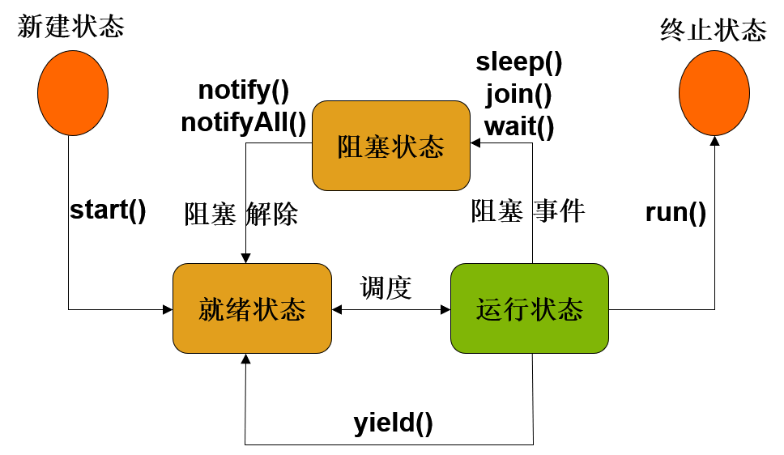

1. 多线程相关的概念

   1. 单任务和多任务：

     单任务：在同一个时间点，只能完成一项任务，后续任务只能等待依次执行；

     单任务是线性的，一个接一个；比如dos系统

     多任务：在同一个时间点，可以完成多项任务，比如：可以一边看处理word，一边看电影，听音乐

     多任务一般分为并发多任务和并行多任务

   2. 并发与并行：

      并发：同一个批量任务，分成不同的组，多个组之间需要争抢资源才能运行，

      	一般情况下，单核操作；同一个时间点，只能处理一个具体的任务；
	
      	（一个CPU处理多项任务）

      并行：同一个批量任务同时进行，每个任务分一组，每组之间互不干扰，真正的多任务；

      	需要多核，多个cpu来支持；每个cpu处理一项任务；多个cpu同时运行；
	
      	（多个CPU处理多项任务）

   3. 进程与线程：

      1. 进程： 

         硬盘中的程序是以文件的形式静态存储，一旦运行程序，在内存中以进程的形式动态运行

         一个运行中程序至少由一个进程组成，也可以是多个进程

         进程会占有独立的内存地址和cpu资源，耗费系统资源比较大 			

      2. 线程：

         动态程序一般由进程组成，进程一般包含线程，线程具有无序性；

         线程不会占有独立的内存地址和cpu资源，只能共享进程资源

         线程不会独立存在，包含在进程内部

         一个进程至少包含一个线程，也可以多个线程；线程只是进程中的一条执行路径


		多线程不是为了提高程序的执行效率，为了提高资源的利用率，压榨cpu和内存资源，以空间换时间。	


	4. 调度策略：
	
	一般在并发计算中，cpu使用需要选择调度策略；
	
	1. 分时调度策略：
	
		cpu会为每个线程分配等同的时间片(帧)资源，依次执行；
	
		无论线程执行是否超时，都会准时切换； 		
	
	2. 抢占式调度策略：
	
		多个线程，谁抢到谁执行
	
		优先级高的先执行，优先级低的后执行；优先级一样，需要争抢资源（理论上）
	
		java采用第二种方式


2. 自定义多线程
   1. 继承Thread类

      a.自定义线程类，继承Thread类，重写run()方法

      b.创建线程对象

      RakyThread t1 = new RakyThread();

      c. 调用start() 启动线程

      t1.start();

   2. 实现Runnable接口  (函数式接口)

      a.自定义线程类，实现Runnable接口，重写run()方法

      b.创建自定义线程类的对象（Runnable）

      	RakyRunnable run = new RakyRunnable();

      c.创建线程对象，把runnable通过构造方法注入进来

      	Thread t1 = new Thread(run);

   	d. 调用start() 启动线程

   		t1.start();

Thread  vs  Runnable

1. 继承Thread类 实现简单，多线程实现与具体的业务绑定，无法分层，不能再继承其他的类

2. 实现Runnable，接口与实现分离，分层的思想；可以再继承其他的类   （推荐）


3. 启动线程：
   1. 使用start()方法调用，不能调用run()

   2. 直接调用run() 就变成了单线程

   3. 多线程分类

      1. 用户线程: 用户自己定义的线程 			

      2. 子线程：相对于主线程来说，一般用户创建的线程都是子线程

      3. 主线程：在主方法中运行的线程

      一般情况下，主线程具有较高的优先级，会优先执行；但不是绝对的。

4. 守护线程

   一般也叫后台服务线程，为用户线程，子线程，主线程提供后台基础的服务的线程；

   举例： GC线程， JVM线程 属于守护线程

   守护线程服务的对象如果没有，此守护线程也没有存在的必要性；

   用户线程是一定可以执行完毕，一旦用户线程执行完，对应的守护线程无论是否完成任务，都会立即结束

   因为服务对象不存在

   t2.setDaemon(true); //设置守护线程 		

5. 线程优先级

   6. cpu线程调度策略： 分时调度， 抢占式调度，java采用第2种
   7. 线程优先级区间 1-10，1最小，10最大
   8. 线程优先级提供几个常量：
       	 MAX_PRIORITY   10   最大优先级

       	 MIN_PRIORITY   1      最小优先级
       	 NORM_PRIORITY  5       默认优先级
   9. 线程的执行顺序
   	 	 理论上： 优先级越高，优先执行；优先级越低，靠后执行；
   	 	 实际上： 优先级的高低和执行顺序不是绝对的；
   	 	 优先级高的线程，优先执行的概率会大一些；


5. 线程常用操作

      1. 线程休眠sleep
          当前线程睡眠一段时间后，继续执行，没有释放cpu资源
           当前先休息，让其他线程来执行；休息好了，继续干活
           休息，单位是毫秒数
           	 
           2. 线程加入join (插队)
              	 在当前执行的线程之前进行插队，插队的线程运行完成之后，当前线程再次执行

              	 多个线程的执行是无序的；保证多个线程执行的有序性，使用join，达到顺序执行
              	 join()方法必须在start()之后才能起作用   
              	 线程按照插队顺序执行，保证线程有序性
              	 3. 线程礼让yield
              	 	 当前线程获取cpu时间片资源的时候进行礼让，让出了资源，让其他线程来执行
               礼让之后，当前的线程也参与争抢资源


6. 生命周期



1. 线程从创建到消亡的整个过程

2. 过程

   1. 新建状态

      自定义一个线程类，创建该类的线程对象，此时线程处于新建状态

   2. 就绪状态

      线程对象，执行 start()方法后，此线程处于就绪状态

      此时线程已经准备好随时运行，只要等待cpu给它分配时间片资源才能运行

      不代表线程立马运行

      （start() 系统编写，程序员调用）

   3. 运行状态

      线程得到cpu时间片资源，系统会自动运行run()方法，此时该线程处于运行状态

      （run()  一般程序员编写，系统调用）

   4. 线程终止

      线程运行完成之后，此时线程处于终止状态

   5. 阻塞状态

      运行状态中的线程遇到i特殊情况中断运行，此时该线程处于阻塞状态

      阻塞状态的情况：

      1. 线程的优先级低
      2. 线程休眠  sleep()  没有释放cpu资源
      3. 线程礼让  yield()  释放cpu资源
      4. 线程插队  join()   插队强制执行（串行化）
      5. 线程等待  wait()  必须对象锁

   6. 阻塞状态  装换成  就绪状态（线程状态转换）

      1. 线程礼让 yield()   释放cpu资源  直接进入  就绪状态

      2. 线程执行  sleep()  / join()  wait()   处于阻塞状态

         sleep()  时间到了，进入就绪状态

         join()  插队执行的线程执行完毕，当前线程处于就绪状态

         wait()  对象锁执行notify()  /  notifyAll()  方法唤醒线程，当前线程处于就绪状态


7. 线程通信

   多个线程在处理对象数据（同一个对象数据）的时候，会进行相互的通信或调用

   1. 前提条件

      1. 统一的对象数据
      2. 需要对象锁支持
      3. 需要同步（sychronized）

   2. 涉及方法

      1. wait()  线程等待

      当前线程的对象锁资源进行同步等待

      对象锁，同步，对象的锁要一致（同一个对象）

      1. notify()  /   notifyAll()  线程唤醒

      当前线程对象锁资源进行唤醒，可以唤醒当前锁对象的其它线程

      同一个对象锁，不同的线程之间是可以进行等待和唤醒切换

8. 临界资源

   多个线程共享的资源（对象的数据）就是临界资源

   当多个线程访问临界资源的时候，可能出现数据不一致的情况，导致多线程问题（临界资源问题）

9. 对象互斥锁

   1. 为了解决临界资源问题，而是用对象互斥锁

   2. 对象锁，也叫互斥锁，具有排他性质；

      当一个线程拿到对象锁的时候，其它线程只能在门外等待；

      只有当前线程执行完成，释放对象锁；其它线程才能运行；

      对象锁可以让线程串行化，但是执行效率比较低，还可能引起线程死锁，默认不开启

   3. 锁实现

      对象互斥锁的实现采用同步机制

      同步两种方式：同步代码块，同步方法，注意对象锁的一致性

10. 线程死锁

    1. 并发运行的多线程，需要等待对方的临界资源，导致假死的情况

       多i线程之间锁定对方的资源导致的假死情况

    2. 线程死锁类似于死循环

    3. 实际开发中，尽量避免线程死锁

11. Timer  
    1. 计时器组件，发送定时任务；
    2. 简单的定时任务使用，复杂的定时任务，使用开源组件Quartz
    3. 常用方法
       1. cancel()  终止定时器
       2. purge()  移除取消任务
       3. schedule(TimeTasj,long delay,long delay)

```java
synchronized是Java中的关键字，是一种同步锁。它修饰的对象有以下几种： 
1. 修饰一个代码块，被修饰的代码块称为同步语句块，其作用的范围是大括号{}括起来的代码，作用的对象是调用这个代码块的对象； 
2. 修饰一个方法，被修饰的方法称为同步方法，其作用的范围是整个方法，作用的对象是调用这个方法的对象； 
3. 修改一个静态的方法，其作用的范围是整个静态方法，作用的对象是这个类的所有对象； 
4. 修改一个类，其作用的范围是synchronized后面括号括起来的部分，作用主的对象是这个类的所有对象。
```

